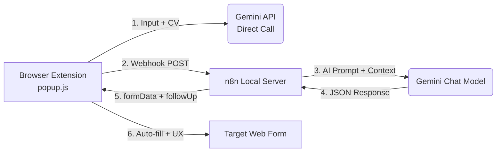

<div align="center">

# ✨ **Clairis**  
### *Your Agentic AI Form Companion*

> **Turn any form into a natural, inclusive conversation — instantly.**  
> **100% local • Serverless • Privacy-first • Multimodal**

[](https://github.com/yourusername/clairis/stargazers)
[](https://opensource.org/licenses/MIT)


</div>

---

## 🌟 **The Future of Form Filling**

**Clairis** is a **standalone, serverless AI agent** that lives in your browser and transforms rigid digital forms into **empathetic, multilingual conversations**.

No backend. No data leaks. Just pure, local intelligence powered by **Google Gemini** and orchestrated by **n8n**.

---

## 🚀 **Core Superpowers**

| Feature | Magic Behind It |
|-------|----------------|
| 🧠 **Agentic Decision Engine** | `n8n` runs locally — full control over AI logic, validation, and JSON output |
| 🖼️ **Client-Side Vision** | Upload ID, screenshot, or doc → **instant OCR** via direct Gemini API call |
| 🗣️ **Human-Like Guidance** | Returns `formData` + `followUpQuestion` with **empathy & clarity** |
| 🌍 **Multilingual & Tone-Adaptive** | Hindi, Tamil, Bengali, etc. — tone shifts from formal to friendly on demand |
| 🎤 **Voice Input** | Speak your profile — **Web Speech API** fills it hands-free |
| 💾 **Local Profile Vault** | Save/load unlimited profiles with `chrome.storage.local` — **no database, no cloud** |

---

## 🏗️ **Architecture: Clean. Local. Secure.**



> **All AI runs locally or via direct API calls. No middleman. No data stored.**

---

## 🔬 **Technical Brilliance**

### **1. Instant Vision Pipeline (No n8n File Bugs!)**

```js
fetch('https://generativelanguage.googleapis.com/v1/models/gemini-pro-vision:generateContent?key=' + API_KEY, {
  method: 'POST',
  body: JSON.stringify({
    contents: [{ role: 'user', parts: [
      { text: "Extract all visible text precisely." },
      { inline_data: { mime_type: "image/jpeg", data: base64Image }}
    ]}]
  })
})
```

→ **Text appears in Profile Data in <1s**

---

### **2. The Conversational JSON Contract**

```json
{
  "formData": {
    "full_name": "Priya Sharma",
    "role": "",
    "experience": "5"
  },
  "followUpQuestion": "Hi Priya! I filled your name and experience.\n\nThe role field is blank — based on your resume, would you like me to suggest:\n• *Senior ML Engineer*\n• *AI Research Lead*\n\nJust say the word! 😊"
}
```

- `""` = safely skipped  
- Multi-line, **warm, actionable** suggestions  
- Feels like a **real assistant**

---

## ⚙️ **Setup in 3 Minutes**

### **Prerequisites**
```bash
# You need:
- Google Gemini API Key
- Chrome (or Chromium browser)
- Node.js
```

---

### **Step 1: Launch n8n (Your Local Brain)**

```bash
npx n8n
```
→ Opens at **[http://localhost:5678](http://localhost:5678)**

---

### **Step 2: Import the Clairis Workflow**

1. In n8n: **Create New Workflow**  
2. Add nodes:  
   `Webhook` → `Google Gemini Chat Model` → `Respond to Webhook`  
3. Paste the **System Prompt** from `popup.js` (look for `SYSTEM_PROMPT`)  
4. **Activate Webhook** → Copy URL → Paste into `popup.js`

---

### **Step 3: Load the Extension**

1. Open `popup.js`  
   ```js
   const GEMINI_API_KEY = "your-key-here";
   const N8N_WEBHOOK_URL = "http://localhost:5678/webhook/xxxx";
   ```
2. Go to `chrome://extensions/`  
   → Enable **Developer Mode**  
   → **Load unpacked** → Select the `clairis-extension/` folder

**Done.** Open any form. Click the **Clairis** icon. Speak, upload, or type.

---

## 📸 **See It in Action**

<div align="center">

| **Conversational Magic** | **Vision Extraction** | **n8n Workflow** |
|--------------------------|------------------------|------------------|
|  |  |  |

</div>

---

## 🔥 **Why Clairis Stands Out**

| Old Way | **Clairis** |
|-------|-----------|
| Forms = frustration | **Forms = dialogue** |
| English only | **10+ Indian languages** |
| Blind to images | **Reads IDs, docs, screenshots** |
| Cloud-dependent | **100% local, private, offline-ready** |
| Generic output | **Empathetic, contextual, human** |

---

## 🎯 **Quick Demo Flow**

1. Click **Clairis** icon on any form  
2. **Speak**: “I’m a data scientist with 4 years at Flipkart”  
3. **Upload ID** → auto-extracts name, DOB, address  
4. **AI fills form** + asks: _“Should I list your role as ‘Senior Data Scientist’?”_  
5. Say **“Yes”** → done.

---

## 🛠️ **Project Structure**

```
clairis/
├── extension/
│   ├── manifest.json
│   ├── popup.html
│   ├── popup.js          # Core logic + prompts
│   ├── content.js        # Form injection
│   └── icons/
├── n8n-workflow.json     # Import this!
└── README.md
```

---

## 🌱 **Contributing**

We welcome **forks, issues, and PRs**!

```bash
git clone https://github.com/yourusername/clairis.git
# Make your magic
git commit -m "Add Telugu support"
git push
```

---

## 📄 **License**

[MIT License](LICENSE) — Free to use, modify, and ship.

---

<div align="center">

### **Clairis doesn’t just fill forms.**  
### **It understands people.**


**Made with precision • Runs with empathy**

</div>