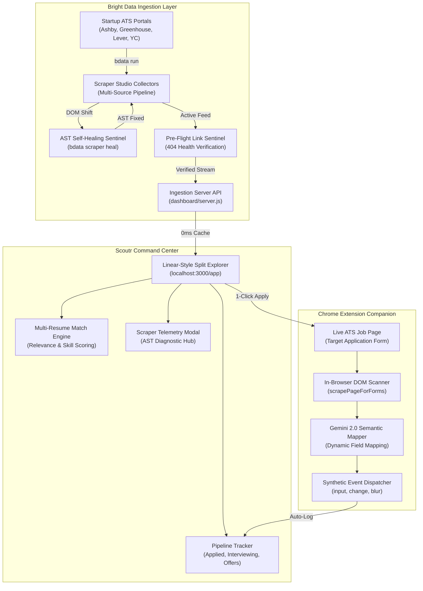

<div align="center">

# Scoutr ✦


### Autonomous Startup Discovery, Self-Healing ATS Scrapers & In-Browser Application Engine

[](https://opensource.org/licenses/MIT)
[](https://brightdata.com)
[](https://developer.chrome.com/docs/extensions/mv3/intro/)
[](https://deepmind.google/technologies/gemini/)
[](https://nodejs.org)

<br/>

> **Scrapes the long tail of startup engineering roles across Ashby, Greenhouse, Lever, and Y Combinator, heals broken selector ASTs in $<1.5\text{s}$ with zero downtime, and executes 1-click in-browser application autofill.**

</div>

---

## Architecture Overview

Scoutr operates across three decoupled layers: **Bright Data Ingestion & Self-Healing Pipeline**, **Command Center & Match Scoring Engine**, and **In-Browser Chrome Autofill Companion**.



---

## Core Capabilities

### 1. Multi-ATS Live Scraping & Pre-Flight Health Sentinel
* **Direct ATS Ingestion:** Parallel collectors stream real-time engineering positions from **Ashby ATS** (Linear, Cursor, ElevenLabs, Decagon, Sierra AI, Modal), **Greenhouse** (Anthropic, Figma, Scale AI, Discord), **Lever** (Palantir), and **Y Combinator** (Work at a Startup & HN Founder feeds).
* **Automated 404 Sentinel:** Validates outgoing URLs through pre-flight HTTP verification, discarding expired or defunct job boards before rendering.
* **Cost-Efficient 2-Tier Caching:** Page loads execute instantly ($0\text{ ms}$) from local cache without redundant API calls. Live web scraping triggers on demand via **Sync Pipeline**.

### 2. Autonomous Self-Healing AST Recovery (`bdata scraper heal`)
* Startup job boards frequently update DOM classnames, attributes, and wrapper elements.
* When selector confidence degrades, Scoutr's sentinel triggers `bdata scraper heal` to parse the mutated AST, generate resilient repair paths, and restore data flow in $\sim 1.4\text{s}$ with zero service interruption.

### 3. Linear-Style Split Explorer & Relevance Scoring
* **High-Density Explorer:** Left-side scannable cards with real-time match badges, compensation, equity, and platform tags; right-side sticky role intelligence drawer.
* **Multi-Profile Matching:** Tokenized candidate evaluation correlates target roles and tech stacks against job descriptions, calculating match scores and highlighting matched skill badges.
* **Interactive Pipeline Tracker:** 1-click status dropdowns (`Applied`, `Clicked / Staged`, `Interviewing`, `Technical Round`, `Offer Received`, `Rejected`) with live metric filter pills.

### 4. In-Browser Form Companion (Chrome Extension MV3)
* **DOM Heuristic Scanner:** Identifies form fields across Ashby, Greenhouse, Lever, Workday, Google Forms, and Microsoft Forms using `aria-label`, parent `<label>`, and placeholder inspection.
* **Synthetic Event Simulation:** Dispatches native `input`, `change`, and `blur` events so reactive frameworks (React, Vue, Next.js) immediately accept autofilled candidate profiles.

---

## Tech Stack & Tools

| Component | Technology | Purpose |
| :--- | :--- | :--- |
| **Scraper Infrastructure** | Bright Data Scraper Studio | Managed cloud collectors and structured DOM extraction |
| **Proxy & Anti-Bot** | Bright Data Web Unlocker | Residential IP routing and automated CAPTCHA bypassing |
| **Self-Healing Engine** | Bright Data CLI (`bdata`) | In-place selector AST repair on schema mutations |
| **Backend Server** | Node.js (Vanilla HTTP/HTTPS) | Zero-dependency high-concurrency API and file server |
| **Frontend Architecture** | HTML5, Vanilla CSS3, Modern JS | High-performance, dependency-free command center |
| **Browser Extension** | Chrome Extensions (Manifest V3) | In-browser DOM form scanner and automated injector |
| **Semantic AI Engine** | Google Gemini 2.0 Flash | Dynamic field mapping and personalized custom pitch generation |
| **Iconography & Fonts** | Lucide Icons, Fragment Mono, Inter | Linear/Raycast-grade minimalist developer aesthetics |

---

## Scraper Studio Multi-Source Architecture

Scoutr organizes data collection across dedicated ATS pipelines:

| Pipeline Collector | Target Ecosystem | Primary Extraction Scope |
| :--- | :--- | :--- |
| **YC Startup Collector** | Y Combinator Startups | Company, batch, title, equity, tech stack, apply URL |
| **Ashby ATS Collector** | Ashby ATS Boards | Role title, department, location, compensation, job ID |
| **Greenhouse Collector** | Greenhouse Portals | Position title, office location, requisition ID, direct URL |
| **Wellfound Collector** | Wellfound / Tech Feeds | Startup stage, funding round, remote availability, salary |

---

## Repository Structure

```text
clairis/
├── package.json               # Project configuration, scripts, and dependencies
├── .env.example               # Environment variable template (Gemini API key)
├── .gitignore                 # Standard Node.js & IDE ignore rules
├── LICENSE                    # MIT License
├── README.md                  # Complete technical architecture documentation
│
├── pipeline/                  # [Module A: Bright Data Scraper Studio]
│   ├── collector.js           # Live Bright Data DCA trigger & stream normalizer
│   ├── heal_monitor.js        # Self-healing test runner & DOM diff recovery
│   └── scraper_config.json    # Collector schemas and target selectors
│
├── dashboard/                 # [Module B: Landing Page & Command Center]
│   ├── index.html             # Product landing page & macOS card preview
│   ├── app.html               # Split-explorer dashboard & pipeline tracker
│   ├── server.js              # High-concurrency parallel scraper server
│   ├── dashboard.js           # Multi-profile manager, match scoring, and cache
│   ├── dashboard.css          # Daytime sky blue tactile design system
│   ├── jobs_feed.js           # Dynamic feed bundle
│   ├── jobs_feed.json         # Scraped structured JSON dataset
│   ├── michael_safety.png     # Product narrative illustration
│   └── lucide.js              # Vector icon library
│
└── extension/                 # [Module C: In-Browser Chrome Extension]
    ├── manifest.json          # Chrome Extension Manifest V3 configuration
    ├── popup.html             # Companion popup UI
    ├── popup.js               # Multi-profile loader, DOM scanner, and form filler
    ├── popup.css              # Sky blue companion theme
    ├── icon.png               # High-resolution extension icon
    └── lucide.js              # Vector icons
```

---

## Quickstart Guide

### 1. Clone & Start the Workspace Server
```bash
git clone https://github.com/wizardwithcodehazard/Scoutr.git
cd Scoutr
npm run dashboard
```
* **Landing Page:** [http://localhost:3000](http://localhost:3000)
* **Command Center App:** [http://localhost:3000/app](http://localhost:3000/app)

### 2. Load the Chrome Extension (Manifest V3)
1. Open Google Chrome and navigate to `chrome://extensions`.
2. Toggle on **Developer mode** in the top-right corner.
3. Click **Load unpacked** and select the `extension` directory.
4. Pin **Scoutr** to your browser toolbar.

### 3. Run Self-Healing Scraper Test Suite
Execute the automated AST repair sentinel to verify recovery logic:
```bash
npm test
```

---

## License
MIT License. Built for Into the Scrape-Verse 2026.
